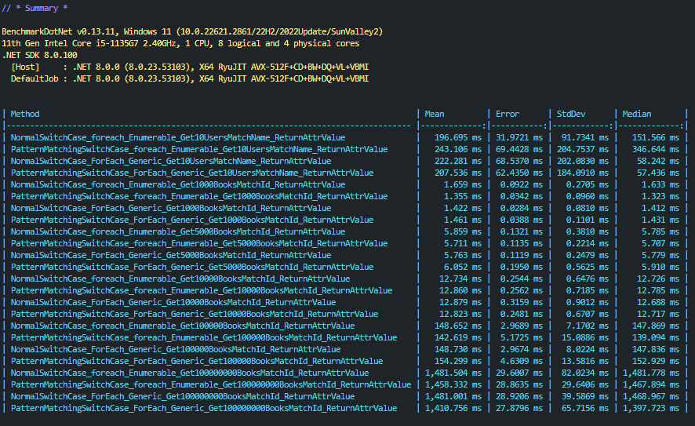

### Tests .NET 8

i'm benching normal switch case that passing inside a foreach and attr bool value and return
i'm benching foreach and [].ForEach too

to more infos see [BenchmarkDotNet.Artifacts/results/Thiago.Benchmarks.SwitchCasePatternMatchingBenchmark-report-github.md](../BenchmarkDotNet.Artifacts/results/Benchmarks.SwitchCasePatternMatchingBenchmark-report-github.md)